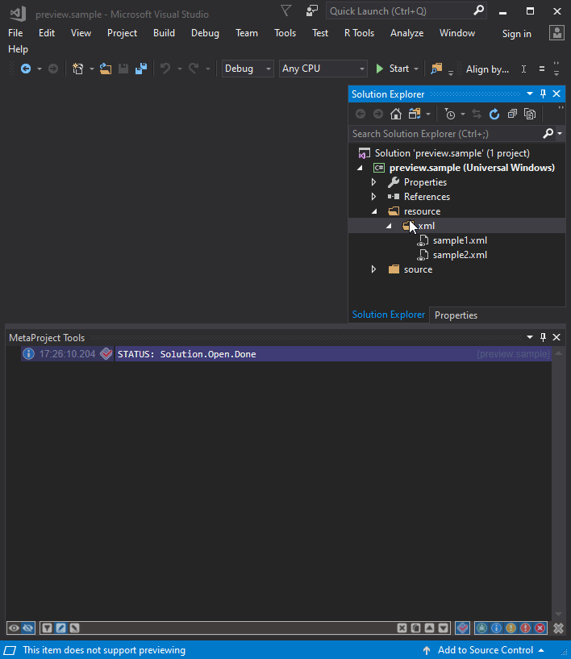

### Now you can look inside [DLL](https://en.wikipedia.org/wiki/Dynamic-link_library), [EXE](https://en.wikipedia.org/wiki/.exe) or [SYS](https://en.wikipedia.org/wiki/.sys) files not opening it.
---

---
Download the extension from the [Visual Studio Marketplace](https://marketplace.visualstudio.com/items?itemName=ViacheslavLozinskyi.Preview-DLL)

---
Data visualization is based on [MetaProject](https://marketplace.visualstudio.com/items?itemName=ViacheslavLozinskyi.MetaProject)

Data extraction is based on [PeNet](http://secana.github.io/PeNet/index.html)